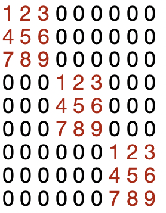

# SudokuJava

## About
This is a simple Sudoku game built with [Java-11](https://www.oracle.com/in/java/technologies/javase/jdk11-archive-downloads.html) and Swing's JFrames. 
The game is interactive, allowing players to enter digits into the grid and see if they are correct or not. 
The game also includes a backtracking algorithm that players can use to solve the puzzle if they get stuck. 
Additionally, there is a "New Game" button that generates a new proper Sudoku puzzle with only one solution.

## Requirements
Java 11 or higher

## Installation
- Clone the repository to your local machine: `git clone https://github.com/ArmanGrewal/SudokuJava.git`
- Open the project in your favorite IDE (e.g. Eclipse, IntelliJ, NetBeans).

## Usage
1. Run the SudokuMain.java file in your IDE to start the game.
2. Use the mouse to click on a cell in the grid and enter a digit (1-9) using the keyboard.
3. Click the "Enter/Return" to see if your current entries are correct. Correct digits will turn green, while incorrect digits will turn red.
4. Press the "Solve" button to automatically fill in the rest of the puzzle using the backtracking algorithm.
5. To generate a new proper Sudoku puzzle with only one solution, click the "New Game" button.
6. To exit the game, simply close the window.

## This is what the game look like
<div align="center">  </div>

## Additional notes about sudoku - 
### Sudoku rules - 
1. It is a grid with 9 rows, 9 columns and 9 boxes (or blocks or regions), each having 9 cells (or squares), for a total of 81 cells
2. Each row, each column and each box must have a unique number in them

### Overview of greedy algorithn to generate new puzzle -  
1. Generate a random completely filled sudoku board [(inspiration)](https://www.geeksforgeeks.org/program-sudoku-generator/)
  - First fill the 3x3 subgrids at the diagonal with random permutations (As they are independent of each other) 
  - Secondly fill all the remaining sudoku board using backtracking
2. Remove random values from the board one by one
3. Check if current board is proper (has only one solution)
4. If current board is not proper, add back the previous value you removed which made the sudoku ("unproper"). 
5. Now you have a "minimal sudoku" at hand, proper sudoku with most possible removed cells.

<div style="display: inline-block;">
  <div style="display: inline-block; width: 50%;">Left content</div>
  
</div>


### Code Heirarchy - 
- ```java 
  public class Cell extends JTextField
  ``` 
  - `newGame()` # reset this cell for new game
  - `paint()`  # paint the cell based on its status (Given, Not given, Correct guess, Wrong guess)
- ```java 
  public class Puzzle 
  ``` 
  - `int[][] numbers` # numbers on the puzzle
  - `boolean[][] isGiven` # need to guess or not
  - `void newPuzzle(int guesses, boolean difficult)` # generates new puzzle with given guesses or most difficult possible
    - `getMostDifficultSudoku()` # Generate most difficult possible sudoku board (using greedy algm)
    - `getSudokuGuesses(int guesses)` # Generate sudoku board with given no. of guesses <br>
      1.`generateSudokuBoard()` # Generates a completely filled random sudoku board <br>
          - `helper_fillSubgrid(int[][], int, int)` # Fills 3x3 subgrids with random permutations <br> 
          - `helper_fillBoard(int[][], int, int)`   # Fills rest of board with correct values (using backtracking) <br> 
      2. `hasUniqueSoln(int[][])` # Check if given sudoku is proper <br>
          - `allSolutions(int[][])` # Returns all possible solutions of current sudoku  <br>
      3. `removeOneElement(int[][])` # Removes one random element from sudoku board
  - `isValid(int[][], int, int, int)` # Checks if given cell placement is valid
  - `isSolved(int[][])` # Check if we have solved the current board   
- ```java 
  public class GameBoardPanel extends JPanel
  ``` 
  - `addBordersAndCells()` # adds borders and numbers to cells
  - `solveAndSet()` # Function added to btnSolve
    - `solve()` # Solves puzzle using backtracking
  - `isValid(int[][], int, int, int)` # Checks if given cell placement is valid
  - `isSolved()` # Check if we have solved the current board   
  - `newGame()` # Function added to btnResetGame
  - ```java
     private class CellInputListener implements ActionListener```
- ```java 
  public class SudokuMain extends JFrame
  ``` 
  - `GameBoardPanel board` # Puzzle 
  - `Jpanel buttonPanel` # Panel for two buttons
    - `JButton btnResetGame` # Button to reset game
    - `JButton btnSolve` # Button to solve the game

## Improvements Pending - 
- ~ Add a reset button to generate new sudokus ~
- Adding a difficulty bar to generate Easy/Medium/Hard sudokus (currently it generates hardest it can find using a Greedy algorithm)
- After entering a guess, highlight all boxes with the same value of the guess and signal the conflicting cells if any.
- Timer (pause/resume), score, progress bar.
- Sound effect, background music, enable/disable sound?
- Try `KeyEvent` with `keyTyped()` handler; or other means that does not require pushing of ENTER key.
- High score and player name?
- Hints and cheats (reveal a cell, or reveal all cells with number 8)?
- Mouseless interface?
- Multi-Player network game.
