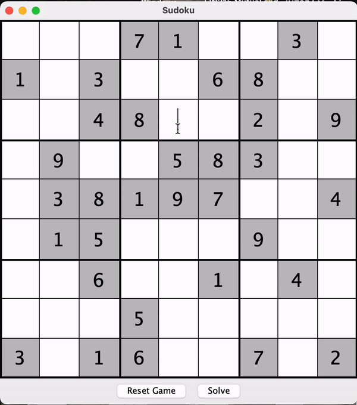

# SudokuJava

## About
This is a simple Sudoku game built with [Java-11](https://www.oracle.com/in/java/technologies/javase/jdk11-archive-downloads.html) and Swing's JFrames. 
The game is interactive, allowing players to enter digits into the grid and see if they are correct or not. 
The game also includes a backtracking algorithm that players can use to solve the puzzle if they get stuck. 
Additionally, there is a "New Game" button that generates a new minimal Sudoku puzzle with only one solution.

## Requirements
Java 11 or higher

## Installation
- Clone the repository to your local machine: `git clone https://github.com/ArmanGrewal/SudokuJava.git`
- Open the project in your favorite IDE (e.g. Eclipse, IntelliJ, NetBeans).

## Usage
1. Run the SudokuMain.java file in your IDE to start the game.
2. Use the mouse to click on a cell in the grid and enter a digit (1-9) using the keyboard.
3. Click the "Enter/Return" to see if your current entries are correct. Correct digits will turn green, while incorrect digits will turn red.
4. Press the "Solve" button to automatically fill in the rest of the puzzle using the backtracking algorithm.
5. To generate a new minimal Sudoku puzzle with only one solution, click the "New Game" button.
6. To exit the game, simply close the window.

## This is what the game look like

